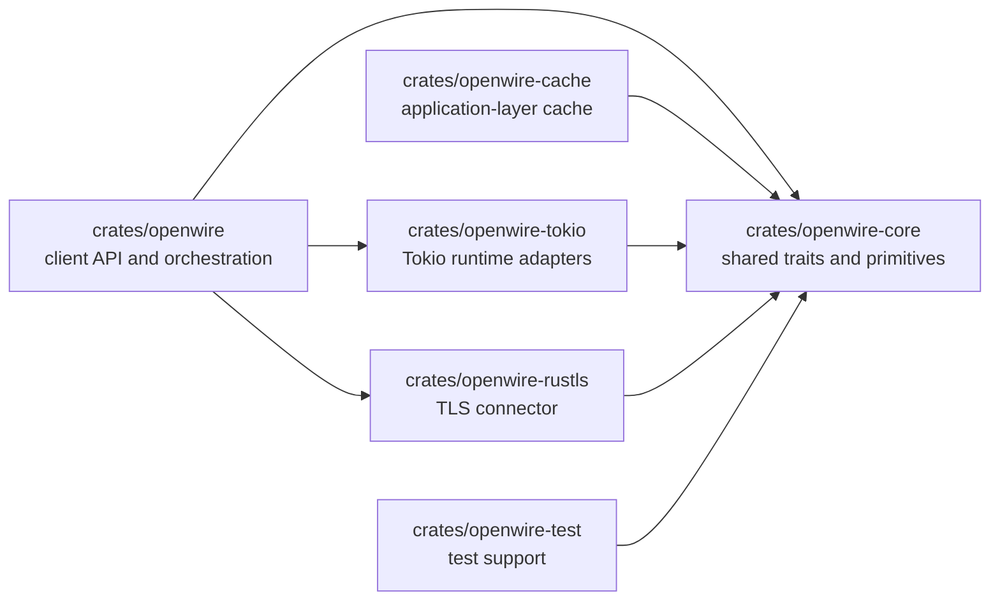
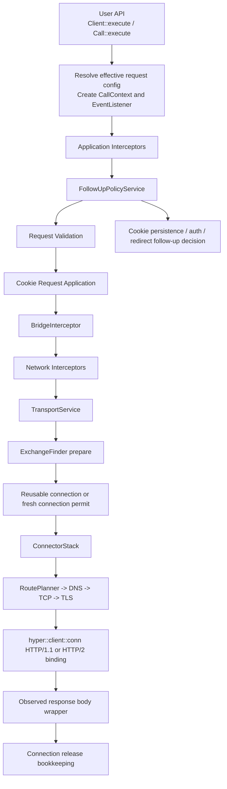
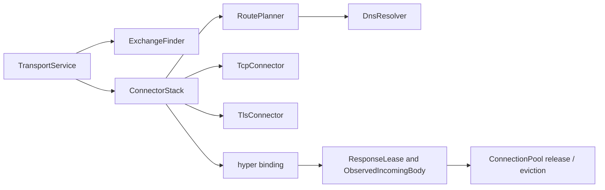

# OpenWire Architecture

Date: 2026-03-24

OpenWire is an OkHttp-inspired async HTTP client for Rust. `hyper` provides
the HTTP/1.1 and HTTP/2 protocol state machines; OpenWire owns request policy,
route planning, connection lifecycle, pooling, proxy behavior, and
observability.

This document is the current architecture reference. Completed plan and closure
docs are intentionally removed once their behavior is absorbed into the code.

Related roadmap docs:

- `docs/error-handling-roadmap.md`

## 1. Design Priorities

- keep policy and transport clearly separated
- keep platform integrations swappable through trait boundaries
- keep connection ownership and release semantics explicit
- keep the request execution path observable and predictable
- keep the implementation mobile-friendly and cross-platform

## 2. Crate Boundaries



| Crate | Responsibility |
| --- | --- |
| `crates/openwire` | public client API, interceptor chain, follow-up policy, bridge normalization, transport orchestration, connection management, route planning |
| `crates/openwire-core` | shared body types, errors, call metadata, event traits, executor/timer traits, transport traits, policy traits |
| `crates/openwire-tokio` | Tokio executor, timer, I/O adapter, system DNS, TCP connector |
| `crates/openwire-rustls` | default Rustls-backed TLS connector |
| `crates/openwire-cache` | application-layer cache interceptor and store |
| `crates/openwire-test` | local test support |

## 3. Canonical Request Flow



No feature should bypass this chain.

## 4. Transport Layering



Transport is split to keep lifecycle-sensitive code isolated and to preserve a
one-way dependency shape from orchestration down to connection establishment and
response-body cleanup.

| File | Responsibility |
| --- | --- |
| `crates/openwire/src/transport/mod.rs` | wiring and re-exports |
| `crates/openwire/src/transport/service.rs` | acquisition, orchestration, bound send path |
| `crates/openwire/src/transport/connect.rs` | route dialing, proxy tunnel setup, DNS/TCP/TLS handoff |
| `crates/openwire/src/transport/protocol.rs` | HTTP/1.1 and HTTP/2 binding, bound-request normalization |
| `crates/openwire/src/transport/bindings.rs` | binding registry and owned connection-task tracking |
| `crates/openwire/src/transport/body.rs` | response-body lifecycle and release semantics |

Primary runtime anchors outside transport:

- `crates/openwire/src/client.rs`
- `crates/openwire/src/policy/follow_up.rs`
- `crates/openwire/src/bridge.rs`
- `crates/openwire/src/connection/`

## 5. Extension Boundaries

These are the intended customization points:

| Trait / Surface | Role |
| --- | --- |
| `Interceptor` | application or network request/response interception |
| `EventListener` / `EventListenerFactory` | attempt-level and transport-level observability |
| `CookieJar` | request cookie application and response cookie persistence |
| `Authenticator` | origin and proxy authentication follow-ups |
| `RetryPolicy` | retry decisions |
| `RedirectPolicy` | redirect decisions |
| `DnsResolver` | host resolution |
| `TcpConnector` | TCP transport establishment |
| `TlsConnector` | TLS handshake / stream wrapping |
| `RoutePlanner` | direct and proxy route construction |
| `WireExecutor` | background task spawning |
| `hyper::rt::Timer` | timer integration |

Default runtime stack from `ClientBuilder::default()`:

- Tokio executor and timer
- system DNS resolver
- Tokio TCP connector
- Rustls TLS connector when the `tls-rustls` feature is enabled

## 6. Operating Rules

- `FollowUpPolicyService` owns retry, redirect, auth, and cookie follow-ups.
- `TransportService` owns connection acquisition, route execution, protocol
  binding, and bound request dispatch.
- `ResponseLease` and `ObservedIncomingBody` own final release bookkeeping.
- HTTP/1.1 reuse is single-exchange and response-body-lifecycle-driven.
- HTTP/2 multiplexing is governed by connection health, allocation tracking,
  and bound-sender readiness.
- `hyper` owns protocol engines; OpenWire owns client semantics.

## 7. Verification Strategy

- unit tests guard protocol parsing, pooling, route planning, timeout, and
  response-lease behavior
- integration tests guard retry/redirect/auth/cookie flow, proxy behavior, and
  connection lifecycle
- the live-network suite is opt-in and not part of the required CI gate

Primary verification commands:

```bash
cargo check --workspace --all-targets
cargo test --workspace --all-targets
```

Optional live-network smoke suite:

```bash
cargo test -p openwire --test live_network -- --ignored --test-threads=1
```
