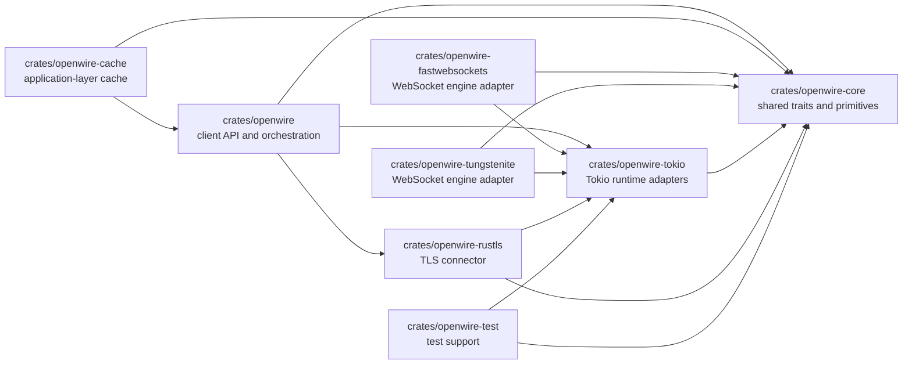
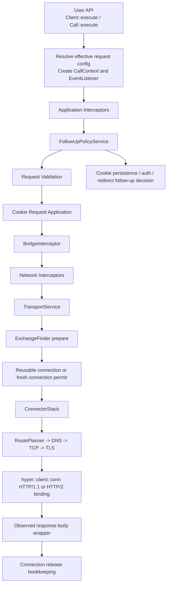
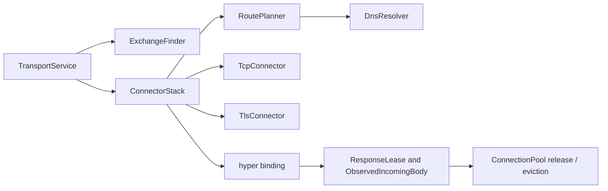
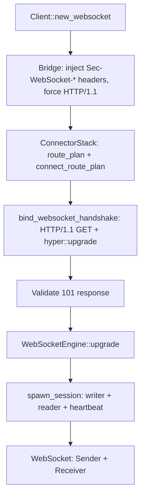

# OpenWire Architecture

Date: 2026-03-24

OpenWire is an OkHttp-inspired async HTTP client for Rust. `hyper` provides
the HTTP/1.1 and HTTP/2 protocol state machines; OpenWire owns request policy,
route planning, connection lifecycle, pooling, proxy behavior, and
observability.

This document is the current architecture reference. Completed plan and closure
docs are intentionally removed once their behavior is absorbed into the code.

Related roadmap docs:

- `docs/error-handling-roadmap.md`

## 1. Design Priorities

- keep policy and transport clearly separated
- keep platform integrations swappable through trait boundaries
- keep connection ownership and release semantics explicit
- keep the request execution path observable and predictable
- keep the implementation mobile-friendly and cross-platform

## 2. Crate Boundaries


```mermaid
flowchart LR
    OW[crates/openwire<br/>client API and orchestration]
    CORE[crates/openwire-core<br/>shared traits and primitives]
    TOKIO[crates/openwire-tokio<br/>Tokio runtime adapters]
    RUSTLS[crates/openwire-rustls<br/>TLS connector]
    CACHE[crates/openwire-cache<br/>application-layer cache]
    FASTWS[crates/openwire-fastwebsockets<br/>WebSocket engine adapter]
    TUNGSTENITE[crates/openwire-tungstenite<br/>WebSocket engine adapter]
    TEST[crates/openwire-test<br/>test support]

    OW --> CORE
    OW --> TOKIO
    OW --> RUSTLS
    CACHE --> CORE
    CACHE --> OW
    FASTWS --> CORE
    FASTWS --> TOKIO
    TUNGSTENITE --> CORE
    TUNGSTENITE --> TOKIO
    TOKIO --> CORE
    RUSTLS --> CORE
    RUSTLS --> TOKIO
    TEST --> CORE
    TEST --> TOKIO
```

| Crate | Responsibility |
| --- | --- |
| `crates/openwire` | public client API, interceptor chain, follow-up policy, bridge normalization, transparent compression, transport orchestration, connection management, route planning |
| `crates/openwire-core` | shared body types, errors, call metadata, event traits, executor/timer traits, transport traits, policy traits |
| `crates/openwire-tokio` | Tokio executor, timer, I/O adapter, system DNS, TCP connector |
| `crates/openwire-rustls` | default Rustls-backed TLS connector |
| `crates/openwire-cache` | application-layer cache interceptor and store, with conservative RFC 9111 freshness and reuse handling |
| `crates/openwire-fastwebsockets` | optional `fastwebsockets` WebSocket engine adapter |
| `crates/openwire-tungstenite` | optional `tokio-tungstenite` WebSocket engine adapter |
| `crates/openwire-test` | local test support; not published to crates.io |

## 3. Canonical Request Flow


```mermaid
flowchart TD
    A[User API<br/>Client::execute / Call::execute] --> B[Resolve effective request config<br/>Create CallContext and EventListener]
    B --> C[Application Interceptors]
    C --> D[FollowUpPolicyService]
    D --> E[Request Validation]
    E --> F[Cookie Request Application]
    F --> G[BridgeInterceptor]
    G --> H[Network Interceptors]
    H --> I[TransportService]
    I --> J[ExchangeFinder prepare]
    J --> K[Reusable connection or fresh connection permit]
    K --> L[ConnectorStack]
    L --> M[RoutePlanner -> DNS -> TCP -> TLS]
    M --> N[hyper::client::conn HTTP/1.1 or HTTP/2 binding]
    N --> O[Observed response body wrapper]
    O --> P[Connection release bookkeeping]
D --> Q[Cookie persistence / auth / redirect follow-up decision]
```

No feature should bypass this chain.

HTTP/2 `421 Misdirected Request` recovery stays inside this chain. Transport
marks responses that arrived over a coalesced HTTP/2 connection; after cookie
persistence and authentication handling, `FollowUpPolicyService` may retry a
replayable `421` request on a non-coalesced connection before redirect handling.

`Call::execute()` and `Call::enqueue()` both enter this same chain. Queued calls
only move dispatch onto the client's configured `WireExecutor`; they do not get
a separate transport path. `CallHandle::cancel()` races against the in-flight
execution at the `Client::execute` boundary, and the response body wrapper keeps
observing cancellation after response headers have been returned so `call_failed`
still reflects body-phase cancellation.

`Call::try_clone()` is a request-template operation, not a transport shortcut.
It creates a fresh unexecuted call only when the request body is replayable, and
the cloned call re-enters the canonical flow when executed.

`BridgeInterceptor` owns HTTP request/response normalization that is above the
transport byte stream but below user-facing application interceptors. That
includes `Host`, `User-Agent`, request body framing headers, WebSocket handshake
headers, and transparent compression. When OpenWire synthesizes `Host`, it uses
the URI authority's normal form by omitting default `:80` / `:443` ports while
preserving explicit caller-supplied `Host` values. When the default
`compression` feature is
enabled, bridge injects `Accept-Encoding: br, gzip, deflate, zstd` only for
requests that did not already specify `Accept-Encoding` and are not range
requests. Matching compressed responses are decoded as a stream on the return
path, with `Content-Encoding` and compressed `Content-Length` removed before the
response reaches application interceptors or callers. Transparent decoding
stops with a body error once the decompressed output exceeds the configured
`max_decompressed_body_bytes` (default 128 MiB). For `deflate`, OpenWire peeks
the first two bytes and selects zlib-wrapped (RFC 1950) vs raw DEFLATE. Network interceptors still
observe the normalized request and wire response for each network attempt.

The transport protocol-binding step applies protocol-specific final shaping.
Direct HTTP/1.1 requests are converted to origin-form before they enter hyper's
HTTP/1.1 client binding. HTTP/2 requests keep their absolute URI but strip
connection-specific fields, including fields named by `Connection`; `TE` is
preserved only for the RFC 9113 `trailers` value.

Transport observability is anchored at the same binding boundary. Once a
connection sender is acquired, `connection_acquired` is emitted before
`request_headers_start`; `request_headers_end` means the request has been
handed to hyper's connection sender. If hyper later reports a send failure
without recovering the request message, the surfaced `WireError` is marked
`request_committed` so retry policy can distinguish unapplied failures from
potentially applied requests.

## 4. Transport Layering


```mermaid
flowchart LR
    TS[TransportService] --> EF[ExchangeFinder]
    TS --> CS[ConnectorStack]
    CS --> RP[RoutePlanner]
    RP --> DNS[DnsResolver]
    CS --> TCP[TcpConnector]
    CS --> TLS[TlsConnector]
    CS --> HB[hyper binding]
    HB --> RB[ResponseLease and ObservedIncomingBody]
    RB --> POOL[ConnectionPool release / eviction]
```

Transport is split to keep lifecycle-sensitive code isolated and to preserve a
one-way dependency shape from orchestration down to connection establishment and
response-body cleanup.

| File | Responsibility |
| --- | --- |
| `crates/openwire/src/transport/mod.rs` | wiring and re-exports |
| `crates/openwire/src/transport/service.rs` | acquisition, orchestration, bound send path |
| `crates/openwire/src/transport/connect.rs` | route dialing, proxy tunnel setup, DNS/TCP/TLS handoff |
| `crates/openwire/src/transport/protocol.rs` | HTTP/1.1 and HTTP/2 binding, bound-request normalization |
| `crates/openwire/src/transport/bindings.rs` | binding registry and owned connection-task tracking |
| `crates/openwire/src/transport/body.rs` | response-body lifecycle and release semantics |

Primary runtime anchors outside transport:

- `crates/openwire/src/client.rs`
- `crates/openwire/src/policy/follow_up.rs`
- `crates/openwire/src/bridge.rs`
- `crates/openwire/src/connection/`

## 5. Extension Boundaries

These are the intended customization points:

| Trait / Surface | Role |
| --- | --- |
| `Interceptor` | application or network request/response interception |
| `EventListener` / `EventListenerFactory` | call-level and transport-level observability |
| `CookieJar` | request cookie application and response cookie persistence |
| `Authenticator` | origin and proxy authentication follow-ups, with `AuthContext::challenges()` exposing RFC 9110 / RFC 7235 `WWW-Authenticate` and `Proxy-Authenticate` challenges |
| `RetryPolicy` | connection-failure and response-status retry decisions |
| `RedirectPolicy` | redirect decisions |
| `ProxySelector` | per-attempt ordered proxy candidate resolution |
| `DnsResolver` | host resolution |
| `TcpConnector` | TCP transport establishment |
| `TlsConnector` | TLS handshake / stream wrapping |
| `RoutePlanner` | direct and proxy route construction |
| `WireExecutor` | background task spawning |
| `hyper::rt::Timer` | timer integration |

`openwire-cache` is intentionally an application interceptor rather than a
transport feature. Fresh cache hits short-circuit before the follow-up
coordinator; cache misses continue through the canonical request flow. The
crate currently implements explicit and conservative heuristic freshness rules
for private in-process caching: request `Cache-Control` directives such as
`no-cache`, `no-store`, `max-age=0`, `max-stale`, `min-fresh`, and
`only-if-cached`, plus HTTP/1.0-compatible request `Pragma: no-cache` when
`Cache-Control` is absent; response `max-age`, `must-revalidate`, `no-cache`,
`no-store`, `public`, `s-maxage`, `Expires`, `Date` apparent age,
Last-Modified heuristic freshness, `Age`, invalid duplicate freshness fields,
and `Vary` matching, including multiple stored variants per URI. Responses to
authenticated requests are stored only when `public`, `s-maxage`, or
`must-revalidate` explicitly permits it; stored authenticated responses also
require the original `Authorization` value to match, even when the server does
not include `Authorization` in `Vary`. Because this is a private cache,
`s-maxage` is treated as an authenticated-storage permit rather than as a
private freshness override. It also
revalidates stale stored responses that carry `ETag` or `Last-Modified`
validators, refreshing stored metadata on `304 Not Modified` before returning
the cached body as `200 OK`. Explicit `max-stale` requests can reuse stale
stored responses when the cached response does not require validation; stale
if-error and background stale revalidation are not implemented. Non-error `2xx`
/ `3xx` unsafe-method responses invalidate stored responses for the request
target URI, plus same-host `Location` and `Content-Location` response URIs
when present.

Default runtime stack from `ClientBuilder::default()`:

- Tokio executor and timer
- direct connection proxy policy via an empty `ProxyRules`
- system DNS resolver
- Tokio TCP connector
- Rustls TLS connector when the `tls-rustls` feature is enabled

## 5a. WebSocket Upgrade Path (`feature = "websocket"`)

`Client::new_websocket(request)` is the dedicated WebSocket entry point.
It returns a `WebSocketCall` builder; `.execute()` performs the handshake
and returns a `WebSocket` (sender + receiver halves).


```mermaid
flowchart TD
    W[Client::new_websocket]
    W --> WB[Bridge: inject Sec-WebSocket-* headers, force HTTP/1.1]
    WB --> WC[ConnectorStack: route_plan + connect_route_plan]
    WC --> WH[bind_websocket_handshake: HTTP/1.1 GET + hyper::upgrade]
    WH --> WV[Validate 101 response]
    WV --> WE[WebSocketEngine::upgrade]
    WE --> WS[spawn_session: writer + reader + heartbeat]
    WS --> WSOK[WebSocket: Sender + Receiver]
```

The WebSocket flow follows `bridge → ConnectorStack → bind_websocket_handshake`,
diverging from the HTTP path at the binding step (it uses
`http1::handshake(io).with_upgrades()` and `hyper::upgrade::on` instead
of `bind_http1` / `bind_http2`). Engine selection is pluggable via
`WebSocketEngine`; the bundled `NativeEngine` implements RFC 6455 directly.

In v1 the WS path does not reuse `TransportService` or its application /
network interceptors, and its connection is not pooled. See
`docs/websocket-design.md` for the full specification and the v2
follow-ups (pool reuse, interceptor chain integration).

## 6. Operating Rules

- `FollowUpPolicyService` owns retry, redirect, auth, and cookie follow-ups.
  Response-status retries are policy decisions after cookie persistence and
  authentication handling and before redirect handling. The default retry policy
  only retries **idempotent** replayable `408 Request Timeout` responses and
  `503 Service Unavailable` responses that explicitly carry `Retry-After: 0`
  (set `retry_non_idempotent(true)` to extend response-status retries to
  non-idempotent methods); delayed, invalid, or duplicate `Retry-After` values
  remain caller-visible responses. Default redirect handling follows `301`,
  `302`, `303`, `307`, and `308` when a valid `Location` is present and policy
  permits it; `300 Multiple Choices` is returned to the caller without automatic
  following. Cross-origin redirects strip `Authorization`, `Cookie`, and common
  API-token headers (`X-Api-Key`, `X-Auth-Token`, and related) while preserving
  `Proxy-Authorization` for sticky proxy routing. Preserve-method redirects
  (`307` / `308`) require a replayable request body; otherwise the original
  redirect response is returned to the caller.
- The default `Jar` cookie store loads an embedded public suffix list so
  `Domain=.com`-style cookies are rejected (RFC 6265 §5.3) and honors `Secure`.
- Connection pool defaults include idle timeout, max idle per host, absolute max
  lifetime, global/per-host connection caps, and a local HTTP/2 concurrent-stream
  budget. Dual-stack route planning prefers starting with IPv6 when both families
  are present (staggered dial, not full Happy Eyeballs v2).
- Request validation rejects non-HTTP(S) schemes, missing authorities or hosts,
  and HTTP URI authorities that include userinfo before bridge normalization can
  derive `Host` or transport can route the request.
- `TransportService` owns connection acquisition, route execution, protocol
  binding, and bound request dispatch.
- HTTP/2 coalescing remains a transport optimization. `TransportService` tags
  caller-visible responses that used a coalesced HTTP/2 connection, while
  `FollowUpPolicyService` retries only replayable `421 Misdirected Request`
  responses carrying that internal tag. The retry request carries an internal
  no-coalescing marker so the next attempt opens or reuses an exact-authority
  connection instead of another coalesced route.
- Forward-proxy HTTP `407` follow-ups are only attempted when the transport
  response carries a selected proxy route. Direct-origin `407` responses remain
  caller-visible responses and do not invoke the proxy authenticator.
- CONNECT proxy `407` challenges are handled during tunnel establishment because
  no end-to-end HTTP response exists yet. That tunnel-local proxy auth loop must
  still receive the logical call counters from `FollowUpPolicyService`; the
  `AuthContext` passed to the proxy authenticator carries the current total
  attempt, retry count, redirect count, and logical auth count plus any completed
  CONNECT-local auth retries. The same logical auth budget gates this loop, so
  CONNECT tunnel proxy authentication cannot exceed the per-call
  `max_auth_attempts` limit by resetting its own local counter. CONNECT retry
  headers are sanitized to the synthetic tunnel `Host` plus proxy-authentication
  headers, so origin auth, cookies, body framing, and other request headers are
  not forwarded into the proxy tunnel handshake.
- `Client::execute` owns call cancellation, final call completion, and wraps the
  returned response body so `call_end` / `call_failed` reflect the whole call.
- `Call::enqueue` is executor-backed dispatch for the same `Call::execute`
  behavior, not a separate policy or transport implementation.
- `ResponseLease` and `ObservedIncomingBody` own final release bookkeeping.
- HTTP/1.1 reuse is single-exchange and response-body-lifecycle-driven.
- HTTP/2 multiplexing is governed by connection health, allocation tracking,
  a local concurrent-stream budget (default 100), and bound-sender readiness.
- `hyper` owns protocol engines; OpenWire owns client semantics.

## 7. Verification Strategy

- unit tests guard protocol parsing, pooling, route planning, timeout, and
  response-lease behavior
- integration tests guard retry/redirect/auth/cookie flow, proxy behavior, and
  connection lifecycle
- the live-network suite is opt-in and not part of the required CI gate

Primary verification commands:

```bash
cargo check --workspace --all-targets
cargo test --workspace --all-targets
```

Optional live-network smoke suite:

```bash
cargo test -p openwire --test live_network -- --ignored --test-threads=1
```

## Connection teardown and connect budgets

- Pool eviction (idle timeout, max idle, max lifetime, explicit remove) aborts the
  owned hyper connection task and clears protocol bindings so sockets are closed,
  not only removed from reuse indexes.
- `connect_timeout` covers TCP establishment, TLS handshake, and protocol binding
  for direct and proxy-tunneled paths.
- HTTP/2 temporary sender unreadiness is handled by awaiting `ready()` on the
  acquired sender under the call deadline, not by parking on pool availability.
- Intermediate follow-up responses (auth / redirect / status retry) drain the
  body up to a small cap before the next network attempt so HTTP/1 connections
  can be reused when possible.
- Transparent decompression failures mark the call for connection discard so
  HTTP/2 connections are not returned to the pool as healthy after a body error.

## Performance notes

- The connection pool is sharded by address hash (`32` shards) so concurrent
  acquire/release for different hosts does not serialize on one global mutex.
  HTTP/2 coalescing still uses a shared index keyed by direct route target.
- Dual-stack route plans share a single `Arc<Address>` across candidate routes
  instead of cloning the full address key per IP.
- Follow-up `RequestSnapshot` stores headers and extensions behind `Arc` so
  auth challenge construction and retry rebuilds avoid re-cloning large maps
  when only metadata is inspected.
- `ResponseBody::text()` reclaims the collected `Bytes` buffer via `into()` when
  unique, avoiding an extra `to_vec()` copy on the common path.

- Default clients wrap the system resolver in `CachingDnsResolver` (30s positive /
  5s negative TTL) to avoid repeated system lookups under connection churn.
- Follow-up snapshots stay light when redirects, retries, and authenticators are
  all disabled, so the common single-shot path skips header/extension cloning.
- Request admission permits are held via response extensions into the call
  lifecycle body, avoiding an extra `BoxBody` layer on the returned response.

