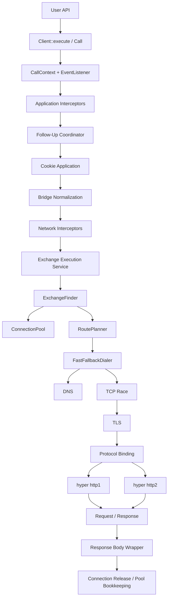

# OpenWire Technical Design

Date: 2026-03-21

This is the single canonical technical design for OpenWire.

Keep this file small, architectural, and current. It should answer:

- what OpenWire owns
- what OpenWire adopts
- what the request execution chain is
- what the target connection core looks like
- what constraints implementation must preserve

Use [tasks.md](tasks.md) for execution sequencing and status tracking.

## 1. Product Direction

OpenWire is an OkHttp-inspired async HTTP client for Rust.

Core goals:

- predictable and observable behavior in production
- clear separation between policy and transport
- extensibility through interceptors and trait boundaries
- cross-platform and mobile-friendly networking
- `hyper` as the protocol engine, not the entire client architecture

Build vs adopt:

- adopt commodity protocol machinery
- own orchestration, lifecycle semantics, observability, and extension points

## 2. Repository Shape

```text
openwire/
├── crates/openwire          public API, policy layer, transport integration
├── crates/openwire-core     shared primitives: body, error, event, interceptor,
│                            runtime, transport traits
├── crates/openwire-rustls   optional Rustls TLS connector
├── crates/openwire-test     test support
└── docs/
    ├── DESIGN.md            canonical technical design
    └── tasks.md             canonical execution tracker
```

Layering rules:

- `openwire-core` contains no retry, redirect, auth, cookie, proxy, or cache policy
- `openwire` owns public API and built-in policy behavior
- `openwire-rustls` stays swappable behind `TlsConnector`
- future cache remains a dedicated crate, not transport logic

## 3. Ownership Strategy

| Area | Direction | OpenWire-Owned Boundary | Default |
|---|---|---|---|
| HTTP protocol engine | Adopt | protocol binding and response lifecycle | `hyper` |
| Connection acquisition / pooling / route planning / fast fallback | Build | `ConnectionPool`, `ExchangeFinder`, `RoutePlanner`, `FastFallbackDialer` | OpenWire |
| Middleware pipeline | Adopt | interceptor and policy ordering | `tower` |
| Runtime integration | Wrap | `Runtime` trait + minimal adapters | Tokio |
| DNS | Adopt + wrap | `DnsResolver` trait | system resolver |
| TCP | Adopt + wrap | `TcpConnector` trait | Tokio TCP |
| TLS | Adopt + wrap | `TlsConnector` trait | `rustls` |
| Cookies | Adopt storage + own orchestration | `CookieJar` trait | `cookie_store` |
| Auth follow-ups | Build | `Authenticator` trait + follow-up coordinator | OpenWire |
| Cache | Build + adopt semantics engine | future cache storage traits | OpenWire + ecosystem |
| Proxy policy | Mixed | public proxy surface + route planning | OpenWire |

## 4. Public API Boundary

Stable external rules:

- request container is `http::Request<RequestBody>`
- send entry points are `Client::execute(request)` and `Client::new_call(request).execute()`
- `ClientBuilder` owns transport and policy configuration
- no parallel OpenWire request builder
- no `client.get(...)` / `client.post(...)` convenience surface while connection-core semantics are still settling
- request-scoped metadata lives in `http::Extensions`

Important public traits:

- `CookieJar`
- `Authenticator`
- `DnsResolver`
- `TcpConnector`
- `TlsConnector`
- `EventListener` / `EventListenerFactory`
- `Interceptor`

Design rule:

- `DESIGN.md` records the shape and semantics
- code remains the source of truth for exact method signatures

## 5. Current Implemented Chain

The current runtime path is:

```text
User API
  -> Client::execute
    -> Client::new_call(request).execute()
      -> create CallContext
      -> create EventListener
      -> application interceptors
        -> FollowUpPolicyService
          -> validate_request()
          -> apply_request_cookies()
          -> BridgeInterceptor (Host, User-Agent, body framing)
            -> network interceptors
              -> TransportService
                -> derive Address
                -> ExchangeFinder
                  -> ConnectionPool lookup / reserve
                  -> if hit:
                    -> owned bound connection sender lookup
                    -> direct hyper request execution
                  -> if miss:
                    -> ConnectorStack
                      -> RoutePlanner
                      -> proxy-aware route construction
                      -> dns
                      -> FastFallbackDialer (direct routes only)
                        -> staggered TCP race
                        -> winner TLS
                      -> tcp (sequential RoutePlan dial for proxy routes)
                      -> tls
                    -> hyper::client::conn::http1 or http2 handshake
                    -> spawn owned connection task
                    -> insert bound connection into ConnectionPool
                    -> direct hyper request execution
          -> store_response_cookies()
          -> authenticate_response()
          -> redirect decision
      -> ObservedIncomingBody wrapper
        -> connection release bookkeeping + pool release
```

This is the implemented baseline, not the target end state.

## 6. Target Execution Chain

The target runtime path is:

```text
User API
  -> Client::execute
    -> create CallContext
    -> create EventListener
    -> application interceptors
      -> follow-up coordinator
        -> cookie request application
        -> bridge normalization
          -> network interceptors
            -> exchange execution service
              -> ExchangeFinder
                -> ConnectionPool lookup
                  -> if hit: acquire pooled RealConnection
                  -> if miss:
                    -> RoutePlanner
                      -> Address
                      -> RoutePlan
                    -> FastFallbackDialer
                      -> dns resolution
                      -> tcp connect race
                      -> winner tls handshake
                      -> protocol binding
                        -> hyper http1 or http2
              -> request write / response head read
        -> store_response_cookies()
        -> authenticate_response()
        -> redirect decision
    -> response body wrapper
      -> connection release / pool bookkeeping
```

No feature should bypass this chain.

## 7. Architecture View



Ownership split:

- OpenWire policy layer: interceptors, follow-up, cookies, auth, redirect
- OpenWire connection core: pool, finder, planner, fast fallback, real connection
- OpenWire adapters: runtime, DNS, TCP, TLS integration
- `hyper`: HTTP/1.1 and HTTP/2 protocol state machines

## 8. Connection Core Object Model

| Type | Responsibility |
|---|---|
| `Address` | stable logical destination and reuse key |
| `Route` | one concrete network path candidate |
| `RoutePlan` | ordered route candidates for one attempt |
| `ConnectPlan` | one candidate attempt state record |
| `RealConnection` | owned live connection object |
| `ConnectionPool` | reusable connection storage and eviction |
| `ExchangeFinder` | pool lookup then acquisition coordinator |
| `RoutePlanner` | builds `RoutePlan` from request destination and config |
| `FastFallbackDialer` | runs staggered racing across route candidates |

First-milestone rules:

- these rules are frozen for the initial self-owned connection-core slice
- exact `Address` equality for reuse
- no broad connection coalescing
- conservative HTTP/2 multiplex accounting
- no speculative preconnect
- no HTTP/3 and no HTTP/3-shaped connection-core abstractions

## 9. Fast Fallback Semantics

Fast fallback is route-based, not family-based.

It should trigger for:

- dual-stack hosts
- single-stack hosts with multiple A records
- single-stack hosts with multiple AAAA records
- future multi-route proxy plans when explicitly supported

First-milestone semantics:

- first connect attempt starts immediately
- later attempts start on a fixed stagger, frozen at a 250ms target by default
- when both IPv6 and IPv4 exist, alternate families where practical
- otherwise preserve resolver order within the single family
- winner means TCP + required TLS + protocol binding all succeed
- losers must be canceled and cleaned up
- if a TCP winner later fails in TLS or protocol binding, remaining routes may continue
- direct routes race resolved target addresses
- proxy routes resolve proxy endpoint addresses into `RoutePlan`, but currently
  execute those proxy routes sequentially
- target addresses behind HTTP forward proxies and CONNECT tunnels remain
  deferred and are not part of fast-fallback racing today

## 10. Protocol Binding

OpenWire will own connection acquisition and reuse, but keep `hyper` for
protocol machines.

This ownership boundary is frozen for the initial migration:

- OpenWire owns address derivation, route planning, acquisition, pooling, and
  lifecycle bookkeeping
- `hyper` owns only the HTTP/1.1 and HTTP/2 protocol state machines
- no request execution path may re-introduce `hyper-util` pooling semantics as
  a shortcut around the owned connection core

HTTP/1.1:

- bind with `hyper::client::conn::http1`
- one active exchange per connection
- reusable only after response body lifecycle completes successfully enough

HTTP/2:

- bind with `hyper::client::conn::http2`
- protocol eligibility decided by ALPN or explicit policy
- one connection may carry multiple exchanges
- pool must track multiplex-capable state explicitly
- until peer stream settings are modeled directly, pool reuse applies a fixed
  conservative concurrent-stream ceiling per connection

## 11. Current Runtime Notes

Important baseline details to preserve during migration:

- cookie and auth behavior currently lives in the follow-up coordinator, not in transport
- exact-address derivation and pool lookup now happen in `TransportService` via `ExchangeFinder`
- pool hits now execute through OpenWire-owned bound connection handles instead
  of a separate runtime pool
- `RoutePlanner` now owns direct-vs-proxy route selection and proxy endpoint
  DNS target choice; `ConnectorStack` executes the resulting route plan
- direct-route cold connects now run through `FastFallbackDialer`; proxy routes
  still dial sequentially
- protocol binding now happens in `TransportService` via
  `hyper::client::conn::http1` / `http2`
- HTTP/1.1 idle timeout and max-idle-per-address limits now enforce
  opportunistically on pool touch points; there is still no background sweeper
- HTTP/2 reuse currently uses a fixed conservative per-connection stream cap
  until negotiated peer settings are tracked explicitly
- response-body lifecycle currently drives connection release bookkeeping
- retained `hyper-util` usage is now limited to
  `hyper_util::client::legacy::connect::{Connection, Connected}` as a temporary
  metadata shim around connector/TLS integration

## 12. Threading And Synchronization

Current baseline:

- request policy/interceptor work still starts on the caller's Tokio task
- direct-route fast fallback now uses short-lived background tasks for staged
  TCP race attempts
- Hyper/OpenWire Tokio runtime glue may spawn background connection-management
  futures, and those futures now preserve the current tracing subscriber and
  active attempt span
- body polling happens on the caller's task
- current synchronization points are small:
  - atomics for global IDs and per-call connection-established flag
  - `RwLock` for the default cookie jar
  - `Mutex<HashMap<Address, Vec<RealConnection>>>` inside `ConnectionPool`
  - `Mutex<HashMap<ConnectionId, ...>>` inside the owned bound-connection
    registry in `TransportService`

Target guidance:

- do not hold pool locks across DNS, TCP, TLS, or protocol-binding awaits
- derive reuse from pool-owned `RealConnection` state
- add background tasks only for clearly owned responsibilities such as eviction or keep-alives

## 13. Performance Notes

Current hot-path observations:

- warm pooled requests are already benchmarked locally for HTTP/1.1 and HTTPS HTTP/2
- current cold-connect path now derives `Address` and ordered `RoutePlan`
  metadata before dialing
- direct routes use staggered fast fallback; proxy routes still execute route
  attempts sequentially
- current per-request service execution still clones boxed service layers

Optimization priority order:

1. extend fast fallback beyond the current direct-route slice
2. remove temporary task-local propagation from the acquisition path
3. avoid avoidable cold-connect cloning
4. preserve low-overhead observability on warm paths

Do not distort API or ownership boundaries merely to chase small allocation wins
before the connection core is owned.

## 14. Error Model

Current `WireErrorKind` surface:

- `InvalidRequest`
- `Timeout`
- `Canceled`
- `Dns`
- `Connect`
- `Tls`
- `Protocol`
- `Redirect`
- `Body`
- `Interceptor`
- `Internal`

Current retry classification treats these as connection-establishment retry
reasons when the body is replayable and retry-on-connection-failure is enabled:

- `Dns`
- retryable `Connect`
- `Tls`
- connect timeout

Required refinement for the owned connection core:

- distinguish TCP failure, TLS handshake failure, TLS policy failure,
  protocol-binding failure, and route exhaustion
- avoid treating permanent TLS policy failures like transient route loss

## 15. Observability

Current tracing baseline:

- `openwire.call`
- `openwire.attempt`
- stable fields for `call_id`, `attempt`, retry/redirect/auth counters,
  `connection_id`, and `connection_reused`

Owned connection-core additions should include:

- `address_id`
- `route_family`
- `route_index`
- `route_count`
- `pool_hit`
- `fast_fallback_enabled`
- `connect_race_id`
- `connect_winner`

Desired connection-core events:

- pool hit / miss
- route plan created
- connect attempt started / lost / promoted
- connection evicted

## 16. Verification Strategy

Baseline commands:

```bash
cargo check --workspace --all-targets
cargo test -p openwire --tests
cargo test -p openwire --test performance_baseline
cargo bench -p openwire --bench perf_baseline -- --noplot
```

Coverage themes to preserve or add:

- request normalization before network interceptors
- retry / redirect / auth event ordering stability
- response-body failure non-duplication
- proxy forward and CONNECT behavior
- cookie persistence around redirects
- warm-path and cold-connect performance regression checks
- future fast-fallback winner/loser lifecycle coverage

## 17. Non-Goals

Not in scope until the owned connection core is stable:

- HTTP/3
- WebSocket support
- Serde / JSON convenience helpers
- multipart helpers
- response decompression policy
- speculative connection warming
- broad connection coalescing
- general middleware crate split
- full OpenTelemetry integration

## 18. Open Questions

- SOCKS support timing and placement
- proxy route fast-fallback policy
- cache integration timing after connection-core ownership lands
- alternate DNS/TLS adapter timing
- mobile-specific connection-core test requirements
